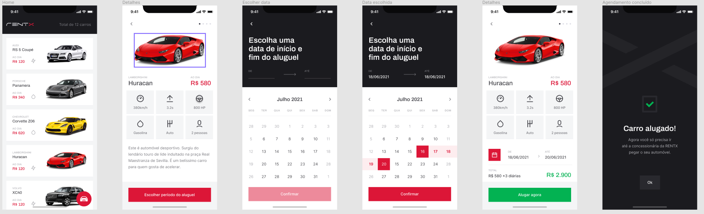

<h1 align="center">
  Rentx
</h1>

<h4 align="center">App desenvolvido durante o curso de React Native da Rockeseat, um app para aluguel de carros</h4>

**Link Figma:** https://www.figma.com/file/kT8OaDg5OWnlRQzdW4Wfcr/RentX-Ignite

## :rocket: Como executar

<ul>
  <li>Instalar no seu celular o app Expo Go</li>
  <li>Clonar o projeto em seu computador</li>
  <li>Abrir o terminal no diretório raiz e executar o comando **yarn** para instalar as dependências</li>
  <li>Copiar o arquivo .env.example e renomear para env.ts</li>
  <li>No terminal,no diretório raiz, executar o comando **yarn api** para iniciar o fake API</li>
  <li>Em outro terminal, no diretório raiz, executar o comando **expo start** para iniciar a aplicação</li>
</ul>

## :speech_balloon: Funcionalidades

<ul>
  <li>Listagem de veículos usando fake API</li>
  <li>Agendar o aluguel do veículo com informações da data e valor do aluguel</li>
  <li>Confirmação do aluguel que será salvo na fake API</li>
  <li>Listagem dos carros que foram alugados recebendo os dados da fake API</li>
</ul>

## :iphone: Recursos Aplicados

<ul>
  <li>Navegação entre páginas</li>
  <li>Styled Components</li>
  <li>Imagens e componentes em SVG</li>
  <li>Fake API utilizando json-server</li>
  <li>Splash Screen animada</li>
</ul>

## ⌨️ Tecnologias

<ul>
  <li>React Native</li>
  <li>TypeScript</li>
  <li>Expo</li>
  <li>React Native Reanimated</li>
  <li>Json-server</li>
</ul>
